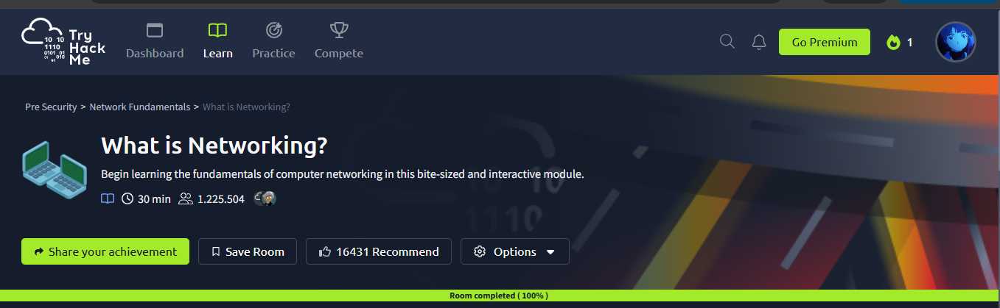

# Module 2 — Network Fundamentals

This folder contains my notes and labs from the **Network Fundamentals module** on TryHackMe.

## Rooms

- What is Networking?
- Intro to LAN
- OSI Model
- Packets & Frames
- Extending Your Network

- ## Lab Completion

## Platform

TryHackMe  
https://tryhackme.com
